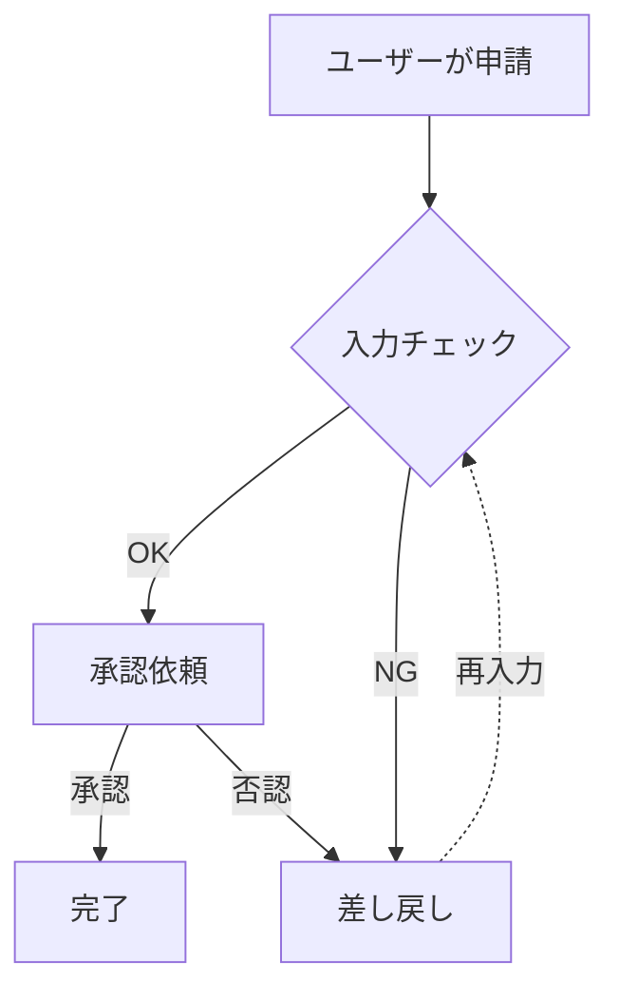
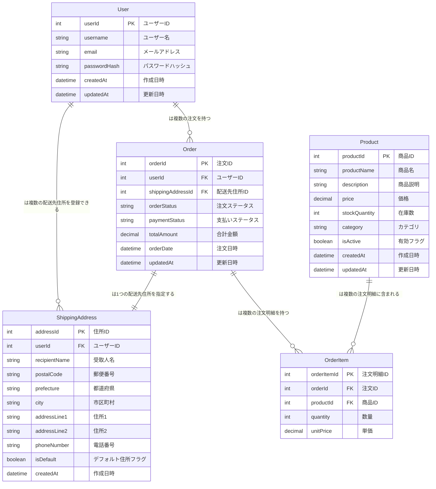
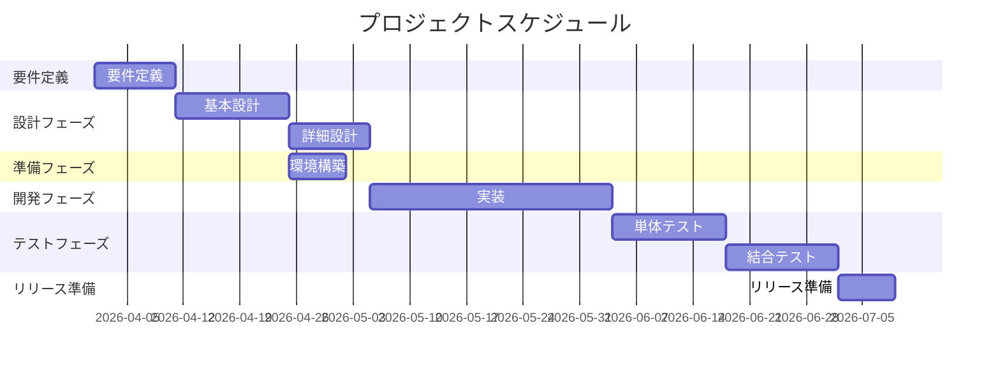

# 自然言語からMCPでmermaidにてフローチャート作成

## 利用しているnodeのバージョン
```
v24.10.0
```

## mcp インストール
```bash
$ npm install -g mermaid-mcp-server
```

## Cline（VSCode拡張)の準備


## cline_mcp_setting.json


```json
{
  "mcpServers": {
    "mermaid-mcp-server": {
      "command": "mermaid-mcp-server",
      "disabled": false,
      "alwaysAllow": []
    }
  }
}
```

### Clineを使う理由
- ClineはMCP対応型クライアント
- つまり
  - Mermaid MCP
  - Git MCP
  - Database MCP
などと接続できる。

## とりあえず使ってみる
プロンプト
```
以下の文章を Mermaid の flowchart で表現して

・「分岐は菱形、開始/終了は丸、例外は点線」
・「日本語ラベルは必ずダブルクォートで囲む」
・「生成後に validate_mermaid を実行し、通らなければ修正して」
・「最後に render_mermaid_svg でSVG化して」

下記内容で作成して
ユーザーが申請 → 入力チェック → OKなら承認依頼 → 承認なら完了、否認なら差し戻し → 入力チェックへ戻る
```

## やってみた結果



## ER図

プロンプト
```
以下の業務説明から Mermaid の erDiagram を生成してください。

【要件】
- 必ず erDiagram 構文を使用する
- すべてのエンティティに主キーを定義する
- 外部キーを明示する
- データ型を必ず記載する（int, string, datetime, boolean など）
- リレーションには多重度を必ず明示する（||--o{ など）
- 中間テーブルが必要な場合は作成する
- エンティティ名は英語の単数形にする
- 属性名も英語にする
- 日本語説明はコメントとして残す
- コードブロックは mermaid 形式で出力する
- 構文エラーがないか自己チェックする

【業務説明】

・ユーザーは会員登録を行う  
・ユーザーは複数の注文を持つ  
・注文には複数の商品が含まれる  
・商品は複数の注文に含まれる  
・商品には在庫数がある  
・注文には支払いステータス（未払い、支払済み、キャンセル）がある  
・ユーザーは複数の配送先住所を登録できる  
・注文は1つの配送先住所を指定する
```

生成結果




## ガントチャート
プロンプト
```
以下のプロジェクト説明から Mermaid の gantt 図を生成してください。

【要件】
- 必ず gantt 構文を使用する
- dateFormat は YYYY-MM-DD にする
- title を必ず付ける
- todayMarker を有効にする
- タスクは section でグルーピングする
- 各タスクは開始日と期間（d単位）を明示する
- 依存関係があれば after を使用する
- コードブロックは mermaid 形式で出力する
- 構文エラーがないか自己チェックする

【プロジェクト説明】

・2026-04-01 から要件定義を10日間実施  
・要件定義完了後、基本設計を14日間  
・基本設計完了後、詳細設計を10日間  
・詳細設計と並行して環境構築を7日間（開始日は基本設計完了後）  
・詳細設計完了後、実装を30日間  
・実装完了後、単体テストを14日間  
・単体テスト完了後、結合テストを14日間  
・結合テスト完了後、リリース準備を7日間  
```




## なぜ直接LLMにプロンプトを渡さずに`mermaid-mcp-server`を利用するのか

- 通常の生成AIの場合
  - 会話の延長線上としてコードをそれっぽく書く
  - Mermaid文法・制約は守ろうとするが保証はない
- mermaid-mcp-server
  - LLMは「Mermaidを直接作文する」のではなく、“Mermaid生成ツール”を呼ぶ形に寄せられる
  - ここでのポイントは、MCPが「Mermaidを作る処理」を 外部ツール（サーバ）側の責務 として切り出すこと

### 大きい差
**再現性と安定性**

- 通常プロンプト：
  - 「Mermaidで」と言っても、毎回微妙に違う書き方になりがち
  - チームの規約（例えばflowchartは必ずTD、ノード命名規則、subgraph構造、色など）を守らせ続けるのが難しい
- MCPツール：
  - サーバ側で「この種類の図はこのテンプレ・この規約」という 強制力 を持たせやすい
  - “出力が壊れたらエラーにする”など 機械的な品質管理 を入れやすい
  - 結果として「同じ入力には同じ構造の図」が出やすく、レビューや差分管理がしやすい
