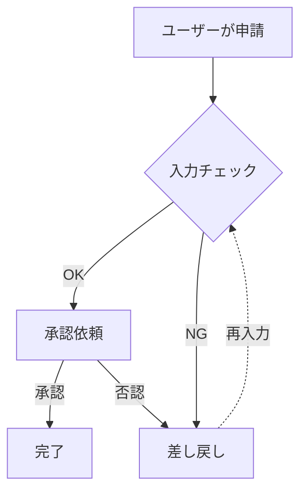

# 自然言語からMCPでmermaidにてフローチャート作成

## 利用しているnodeのバージョン
```
v24.10.0
```

## そもそもMCPとは
- AIがほかツールを安全に呼び出すための共通規格

## mcp インストール
```bash
$ npm install -g mermaid-mcp-server
```

## Cline（VSCode拡張)の準備


## cline_mcp_setting.json


```json
{
  "mcpServers": {
    "mermaid-mcp-server": {
      "command": "mermaid-mcp-server",
      "disabled": false,
      "alwaysAllow": []
    }
  }
}
```

## とりあえず使ってみる
プロンプト
```
以下の文章を Mermaid の flowchart で表現して

・「分岐は菱形、開始/終了は丸、例外は点線」
・「日本語ラベルは必ずダブルクォートで囲む」
・「生成後に validate_mermaid を実行し、通らなければ修正して」
・「最後に render_mermaid_svg でSVG化して」

下記内容で作成して
ユーザーが申請 → 入力チェック → OKなら承認依頼 → 承認なら完了、否認なら差し戻し → 入力チェックへ戻る
```

## とりあえずの結果



